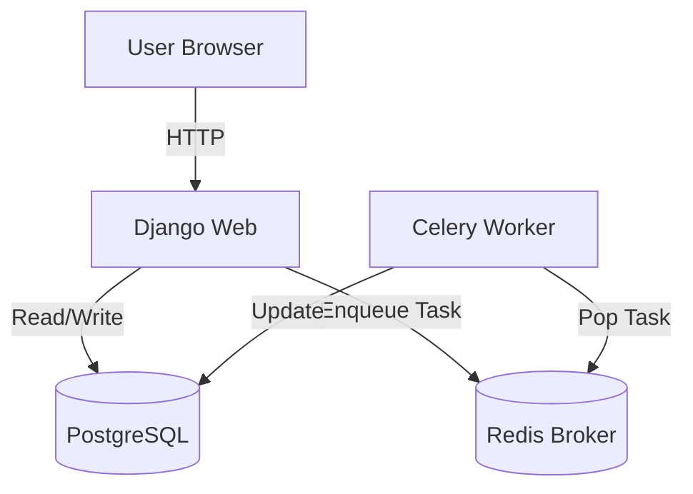
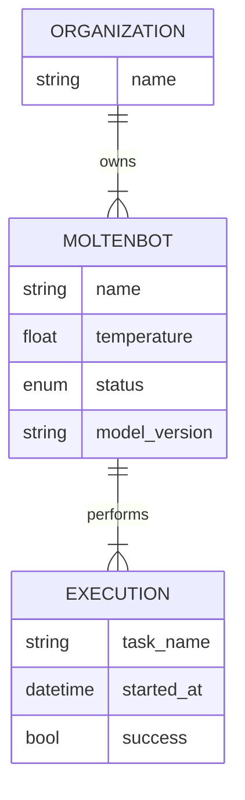

# Moltenbot Architecture

## Overview
Moltenbot Control Center is a Django-based application designed to manage a fleet of high-temperature AI agents. It follows a **Polling Architecture** where the frontend periodically fetches the state of the world from a REST API.

## System Components

### 1. Docker Infrastructure
- **Web Container**: Python 3.11 + Django (Gunicorn/Development Server).
- **Worker Container**: Celery Worker for background tasks.
- **Cache/Broker**: Redis 7.
- **DB Container**: PostgreSQL 15.

### 2. Backend (Django)
- **Core App**:
    - `MoltenBot`: The primary domain entity.
    - `Organization`: Multi-tenancy grouping.
    - `Execution`: Immutable log of work done by bots.
    - **Tasks**: Celery tasks for heavy lifting (e.g., mass updates).
- **API**: Django Rest Framework (DRF) provides JSON endpoints at `/api/`.
- **Admin**: Heavily customized for "Ops" work (shutdown/reheat actions).

### 3. Frontend (Dashboard)
- **Stack**: Django Templates + Vanilla JS + CSS3.
- **Theme**: Premium Dark Mode with Neon accents.
- **Data Flow**:
    1. Page Loads -> Renders Skeleton.
    2. JS `fetch()` calls `/api/bots/` and `/api/executions/`.
    3. DOM updated with new state.
3. DOM updated with new state.
    4. Repeat every 2 seconds.

## System Architecture

## Database Schema (Simplified)

## Security Considerations
- **Secrets**: Managed via `.env` (passed to Docker).
- **Allowed Hosts**: Configured via env vars.
- **Validation**: Temperature limits enforced at Model level to prevent physical hardware damage (melting).
