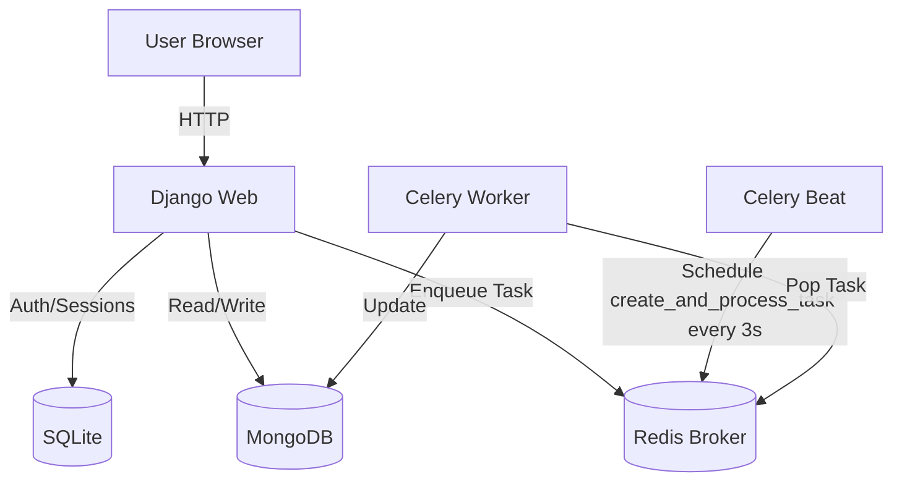

# Mantis Shrimp Bot Architecture

## Overview
Mantis Shrimp Bot Control Center is a Django-based application designed to manage a fleet of high-temperature AI agents. It follows a **Polling Architecture** where the frontend periodically fetches the state of the world from a REST API. Celery Beat drives a live task feed: every 3 seconds a new task is created and a random online bot picks it up and completes it (with random success or failure).

## System Components

### 1. Docker Infrastructure
- **Web Container**: Python 3.11 + Django (Gunicorn/Development Server).
- **Worker Container**: Celery Worker for background tasks.
- **Beat Container**: Celery Beat scheduler for periodic tasks (e.g., auto-create tasks every 3 seconds).
- **Cache/Broker**: Redis 7.
- **DB Container**: MongoDB 7 (NoSQL, used via MongoEngine).

### 2. Backend (Django)
- **Core App** (MongoEngine / NoSQL):
    - `MantisShrimpBot`: The primary domain entity (MongoDB document).
    - `Organization`: Multi-tenancy grouping.
    - `Execution`: Immutable log of work done by bots.
    - **Tasks**: Celery tasks for heavy lifting (e.g., mass updates, `create_and_process_task` every 3 seconds).
- **API**: Django Rest Framework (DRF) provides JSON endpoints at `/api/`.
- **Admin**: Custom admin for MongoEngine documents (shutdown/reheat actions).
- **Management Commands**: `seed_data` pre-seeds organizations, bots, and executions.

### 3. Frontend (Dashboard)
- **Stack**: Django Templates + Vanilla JS + CSS3.
- **Theme**: Premium Dark Mode with Neon accents.
- **Data Flow**:
    1. Page Loads -> Renders Skeleton.
    2. JS `fetch()` calls `/api/v1/bots/` and `/api/v1/executions/`.
    3. DOM updated with new state.
    4. Repeat every 2 seconds.

## System Architecture

## Database Schema (MongoDB / NoSQL)

Collections and document structure (MongoEngine):

- **organizations**: `{ name, created_at }`
- **mantis_shrimp_bots**: `{ name, organization (ref), model_version, temperature, status, formatted_status }`
- **executions**: `{ bot (ref), task_name, started_at, completed_at, success }`

References use MongoDB ObjectIds. Django auth/sessions use SQLite.

## Security Considerations
- **Secrets**: Managed via `.env` (passed to Docker).
- **Allowed Hosts**: Configured via env vars.
- **Validation**: Temperature limits enforced at Model level to prevent physical hardware damage (melting).
